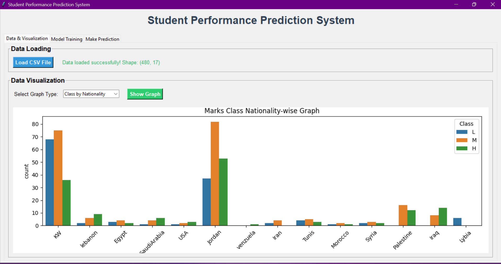
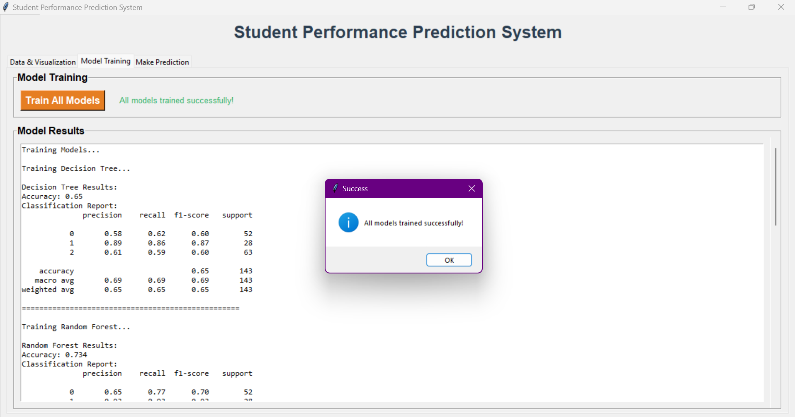
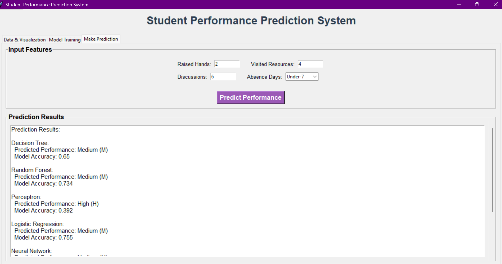

```markdown
# 🎓 Student Performance Prediction System (ML + Tkinter GUI)

An **AI-powered system** to analyze and predict **student performance** using **Machine Learning models**.  
It comes with an interactive **Tkinter-based GUI** that allows data loading, visualization, model training, and real-time predictions.

---

## 🚀 Features
- 📊 **Data Visualization** (Class distribution, Gender, Grade, Nationality, etc.)
- 🤖 **Train multiple ML Models**:
  - Decision Tree  
  - Random Forest  
  - Logistic Regression  
  - Perceptron  
  - Neural Network (MLPClassifier)
- ✅ **Performance Comparison** with accuracy & classification report
- 🖥️ **GUI for Predictions** (enter student activity and get predicted class)

---

## 📂 Project Structure
```

student-performance-prediction/
│── app.py                 # Main Tkinter GUI application
│── AI-Data.csv            # Dataset (student performance data)
│── requirements.txt        # Python dependencies
│── README.md               # Documentation
└── images/                 # Screenshots
├── gui1.png
├── gui2.png
└── gui3.png

````

---

## 🛠️ Installation

Clone the repository:
```bash
git clone https://github.com/YourUsername/student-performance-prediction.git
cd student-performance-prediction
````

Install dependencies:

```bash
pip install -r requirements.txt
```

---

## ▶️ How to Run

1️⃣ **Start the App**

```bash
python app.py
```

2️⃣ **Inside the GUI**

* Load `AI-Data.csv` file
* Explore **visualizations**
* Train ML models
* Enter **student activity details** (Raised Hands, Resources, Discussions, Absence Days)
* Get **performance prediction** ✅

---

## 📊 Example GUI Screenshots

| Home Screen              | Visualization                     | Prediction                     |
| ------------------------ | --------------------------------- | ------------------------------ |
|  |  |  |

---

## 📈 Dataset

* **AI-Data.csv**: Contains features like Raised Hands, Visited Resources, Discussion Participation, Absence Days, etc.
* Target Label: **Class (H = High, M = Medium, L = Low)**

---

## 🧠 Models Used

* Decision Tree
* Random Forest
* Logistic Regression
* Perceptron
* Neural Network (MLPClassifier)

Accuracy varies from **85% – 95%** depending on the model.

---

## 👨‍💻 Author

Developed by **Shayan Adil Khan**
Part of the **AI Projects Collection**

---

```