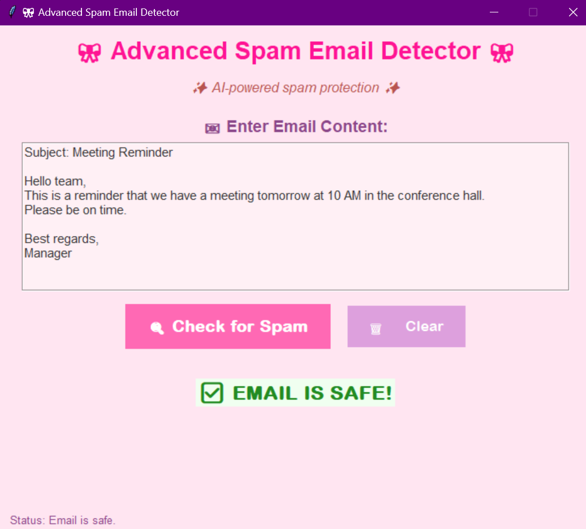

---

## 📄 `README.md`

```markdown
# 📧 Spam Email Detector 🎀

An **AI-powered spam email detection system** built with **Python, Scikit-learn, and Tkinter GUI**.  
This project trains a **Naive Bayes classifier** on the SMS Spam Collection dataset and provides a **user-friendly Tkinter desktop app** to check if an email is **spam or safe**.

---

## 🚀 Features
- ✅ Train a spam detection model using Naive Bayes  
- ✅ Save & load trained models using Pickle  
- ✅ Text preprocessing with CountVectorizer (unigrams + bigrams)  
- ✅ Interactive Tkinter GUI with animations and hover effects  
- ✅ Real-time spam email classification with confidence score  

---

## 📂 Project Structure
```

Spam\_mail\_detector/
├── gui\_app.py                  # Tkinter GUI application
├── train\_model.py              # Script to train the model
├── count\_vector\_email.pickle   # Saved CountVectorizer (generated after training)
├── spam\_email\_detector.pickle  # Saved Naive Bayes model (generated after training)
├── model\_summary.pickle        # Model summary with accuracy and dataset info
├── requirements.txt            # Dependencies
├── gui.png                     # Screenshot of the GUI
└── README.md                   # Documentation

````

---

## 🛠️ Installation

Clone the repository:
```bash
git clone https://github.com/YourUsername/AI_Projects.git
cd AI_Projects/Spam_mail_detector
````

Install dependencies:

```bash
pip install -r requirements.txt
```

---

## ▶️ How to Run

### 1️⃣ Train the Model

```bash
python train_model.py
```

This will:

* Download & preprocess the SMS dataset
* Train the Naive Bayes spam classifier
* Save the model and vectorizer as `.pickle` files

### 2️⃣ Run the GUI

```bash
python gui_app.py
```

Then enter your email content and check if it’s spam or safe ✅

---

## 📊 Model Performance

* **Dataset size:** \~5,574 SMS messages
* **Algorithm:** Multinomial Naive Bayes
* **Accuracy:** \~97% on test set
* **Label encoding:** `0 = SPAM`, `1 = HAM (Safe)`

---

## 🖼️ GUI Preview

Here’s how the app looks:



---

## 👨‍💻 Author

* Developed by **Shayan Adil Khan**
* Part of the **AI Projects** Repository

```

---

✅ Save this file as `README.md` in your project folder.  
Do you also want me to **generate a sample `gui.png` preview mockup** (like a fake screenshot), or do you prefer to take a real screenshot of your running app?
```
